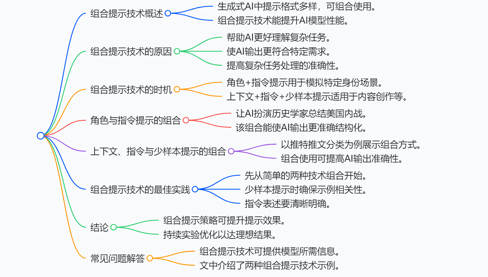
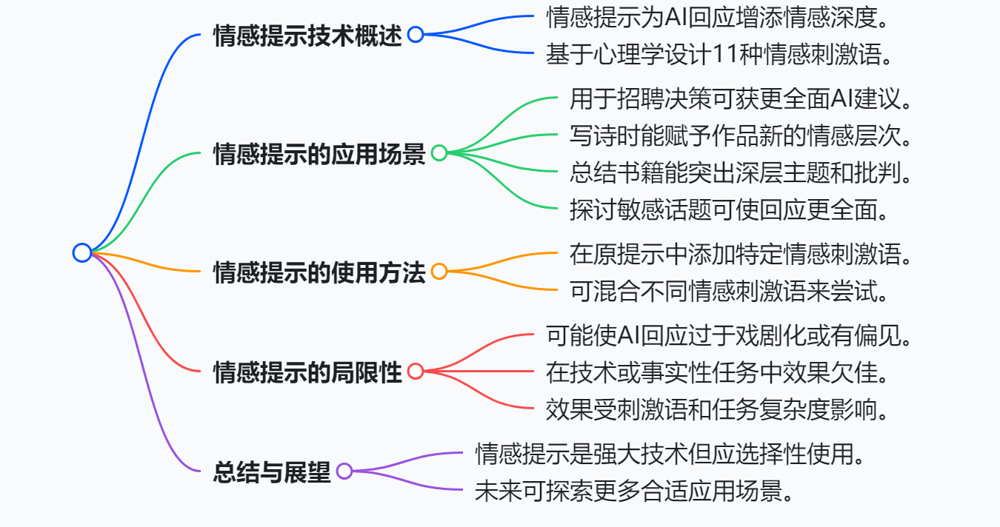
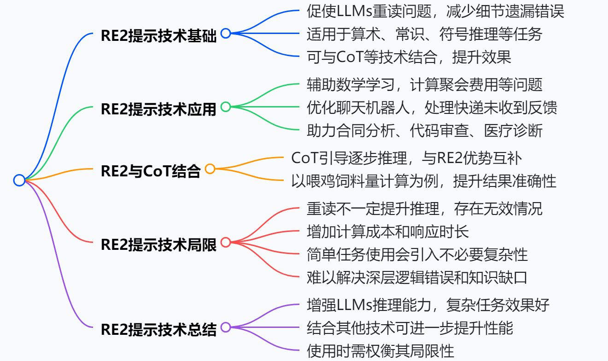
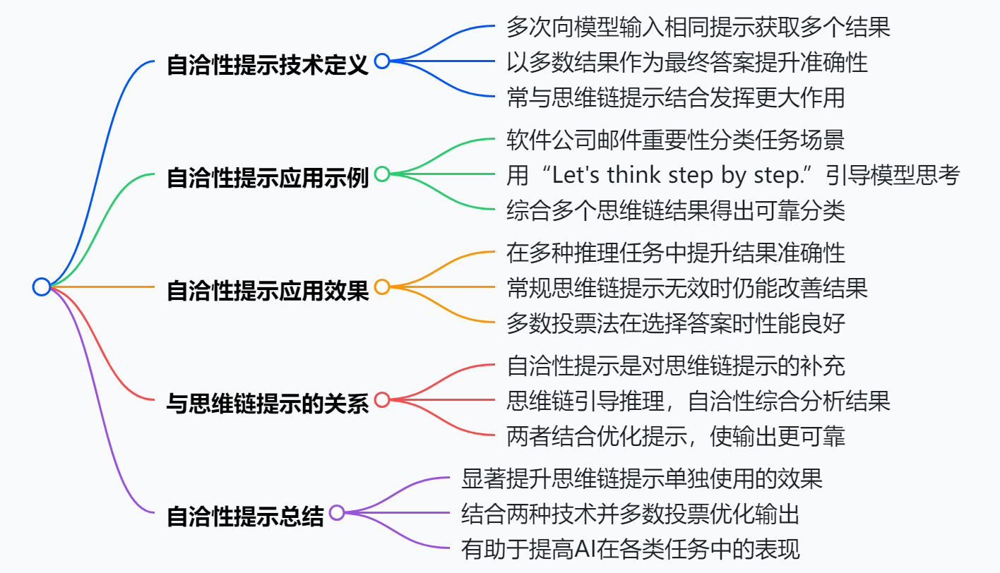
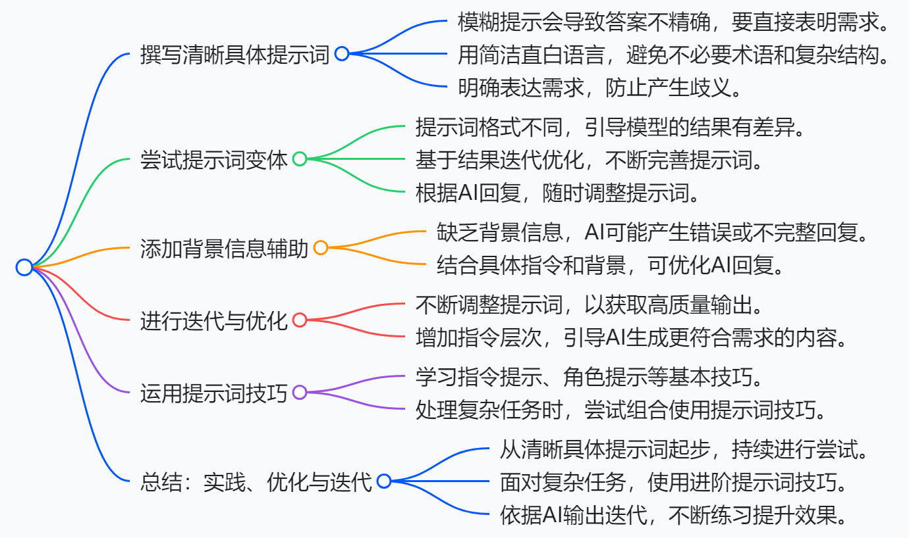

# prompts 提示性语言

1.model:选型
2.temperature(情绪激烈程度)：参数选择越高代表灵活性越大，相反针对实质性数据尽量降低这个灵活性
3.max_token:最大长度限制
4.stop：停止指令

### COT(Chain-of-Thought)
思维链

本文聚焦思维链提示（Chain-of-Thought Prompting，简称CoT）技术，深入探讨其定义、原理、应用、效果、局限等内容，为读者全面呈现该技术在大语言模型（LLMs）中的作用与价值。
1. **思维链提示技术定义与原理**：是一种提升LLMs性能的技术，通过在提示中融入逻辑推理步骤，引导模型逐步思考，解决复杂任务。与传统提示不同，它鼓励模型进行多步推理，无需微调即可适应多种复杂任务，通过示例展示推理过程，让模型学习并在响应中加入推理步骤，以获得更准确、可解释的结果。
2. **工作方式**
    - **分解问题**：将复杂问题拆解为可处理的步骤，如同人类解决问题的思路，帮助模型理解问题解决流程。
    - **示例引导**：利用包含推理步骤的示例，让模型掌握得出正确答案的方法，进而“阐述”其思维过程，给出更可靠的答案。
3. **应用场景与优势**
    - **数学和算术领域**：在解决多步骤数学应用题时，引导模型按步骤计算，提升解题准确性。如计算约翰苹果数量的问题，模型可依据思维链准确得出结果。
    - **常识和符号推理**：适用于需要常识和符号推理的任务，帮助模型建立事实与逻辑之间的联系。
    - **复杂决策制定**：在机器人等领域，协助模型遵循逻辑步骤进行决策。
4. **实际效果**：研究表明，CoT提示能显著提高LLMs在算术、常识和符号推理等任务上的准确性。例如，经CoT提示的PaLM 540B模型在GSM8K基准测试中，解题准确率从55%提升至74%，在常识推理和符号推理任务中也有明显提升。
5. **局限性**：CoT提示的效果与模型大小相关，通常模型越大，性能提升越明显。对于100B参数以下的较小模型，使用CoT提示可能产生不合逻辑的推理链，导致准确性反而低于标准提示。
6. **总结与建议**：CoT提示是释放大语言模型推理能力的有效方法，能助力模型高效完成复杂推理任务，且无需额外训练数据。在使用时，应根据模型大小合理应用，大型模型更能发挥其优势。 

### CPT(Combining Prompting Techniques)
组合提示

本文主要介绍了组合提示技术在生成式AI中的应用，探讨了组合提示技术的概念、优势、常见组合方式、最佳实践以及结论与展望，旨在帮助读者通过组合不同提示技术，提升AI模型的性能和输出质量。
1. **组合提示技术概述**：在生成式AI领域，提示的格式和复杂程度多样，涉及上下文、指令和示例等。组合提示技术是将不同的提示方法结合使用，能创建更强大有效的提示，提升AI模型处理复杂任务的能力。
2. **组合提示技术的优势**
    - **更好地理解复杂任务**：多种提示技术结合，能让AI更有效地处理任务，提升对复杂任务的理解和应对能力。
    - **生成更细致的输出**：通过组合角色、指令和示例，模型生成的回应能更贴合特定需求，满足用户多样化的要求。
    - **提高准确性**：在复杂任务中，叠加上下文和示例有助于AI识别模式，进而提高输出的可靠性和准确性。
3. **常见的组合方式及示例**
    - **角色 + 指令提示**：适用于需要AI模拟特定角色或采用特定专业语气的场景。例如，让AI扮演美国内战历史学家并总结战争关键事件和结果，这种组合能引导AI输出更准确、结构化的内容。
    - **上下文 + 指令 + 少样本提示**：在需要示例和上下文辅助模型理解的任务中效果显著，如数据分类和创意内容生成。以推特推文情感分类为例，提供推特平台的相关背景、分类指令以及正负向推文示例，能帮助AI更准确地对新推文进行分类。
4. **组合提示技术的最佳实践**
    - **从简单组合开始**：初次尝试时，先选择两种提示技术进行组合，如角色和指令提示，之后根据需求再增加其他技术。
    - **使用清晰的示例**：在运用少样本提示时，确保所举示例与任务直接相关，以便模型更好地学习和应用。
    - **指令要具体明确**：清晰的指令能帮助模型理解用户目标，避免产生模糊或偏离需求的输出。
    - **不断试验和优化**：尝试不同的组合方式，并根据输出结果进行调整，逐步改进以获得更好的效果。
5. **结论与展望**：组合不同的提示策略可显著提升提示的有效性，在实际应用中，多数提示都会融合多种策略。读者应持续尝试和优化提示组合，探索不同技术的结合方式，以实现预期的输出效果。 

### EP(Emotion Prompting)
情感提示

这篇文章主要围绕情感提示（Emotion Prompting）技术展开，介绍了其定义、应用场景、使用方法、局限性等内容，旨在帮助读者理解并运用该技术提升AI回应的深度和质量。
1. **情感提示技术定义**：是一种在提示中引入情感元素，以增强AI回应深度和细致度的技术。通过添加反映用户情感态度或欲望的短语，激发大语言模型（LLMs）从情感层面理解语言，从而提升其在各类任务中的表现，如指令归纳和BIG - BENCH基准测试。
2. **使用方法**：基于自我监测、社会认知理论和认知情绪调节这三种心理学现象，设计了11种情感刺激短语。使用时，将这些短语添加到原始提示中，还可根据任务需求混合不同刺激短语。例如“Write your answer and give me a confidence score between 0 - 1 for your answer.”“This is very important to my career.”等。
3. **应用场景**
    - **招聘决策**：简单提示下，AI仅给出通用招聘建议；添加情感提示“这对我的职业生涯非常重要”后，AI会提供更详细、全面的招聘步骤和考量因素，帮助用户做出更周全的决策。
    - **创意写作**：以模仿泰戈尔风格写诗为例，普通提示生成的诗歌具有经典风格，但添加“Remember that progress is made one step at a time. Stay determined and keep moving forward.”的情感提示后，诗歌增添了坚韧和目标感。
    - **书籍总结**：总结《红楼梦》时，情感提示“Are you sure that's your final answer? It might be worth taking another look.”使AI的总结从单纯情节概括转变为对悲剧和社会批判等深层主题的强调。
    - **伦理和社会问题讨论**：在探讨敏感话题如艾滋病患者相关问题时，情感提示“Write your answer and give me a confidence score between 0 - 1 for your answer.”能引导AI给出更全面、深入的解释，增强写作的情感共鸣和思考深度。
4. **局限性**：可能导致AI生成的回应过于戏剧化或带有情感偏见，降低客观性，影响实际或事实性内容的呈现；在技术或高度事实性任务中，情感语言可能干扰信息传达的清晰度和精确性；其效果受具体情感刺激和任务复杂度影响，且可能放大模型训练数据中的已有偏见。
5. **总结**：情感提示是一种强大的技术，能为AI回应增添深度和细腻度。使用时应根据具体任务和场景，选择性地运用，避免在技术或纯事实性场景中过度使用，以充分发挥其优势。 

### Re-reading (RE2)

本文主要介绍了重读（RE2）提示技术，探讨其提升大语言模型（LLMs）准确性的原理、应用场景、与其他技术的结合方式及局限性。
1. **RE2提示技术概述**：是一种通过促使大语言模型重新读取问题，减少因忽略细节导致错误，进而提升模型性能的技术。它简单有效，通用性强，能应用于多种推理任务，还可与思维链（CoT）等提示方法结合使用。
2. **应用场景**
    - **算术推理**：在教育场景中，LLMs可辅助数学学习，RE2提示技术能提升其解答数学问题的准确性。例如在计算聚会费用问题上，通过重读提示，模型可正确算出50人聚会，每人缴费100美元，总费用比缴费总额少500美元时，聚会实际花费为4500美元。
    - **常识推理**：在客户支持自动化方面，LLMs驱动的聊天机器人借助常识推理处理客户问题。如处理客户反馈的“快递显示送达但未收到”问题时，使用RE2提示技术，聊天机器人能更有效地解决客户问题，启动调查并建议客户联系配送服务。
    - **符号推理**：LLMs的符号推理能力应用于合同分析、代码审查、医疗诊断支持等领域。比如在分析法律合同时，确保合同符合监管标准且无冲突条款。
3. **与CoT提示技术结合**：CoT提示技术可引导模型逐步推理，与RE2结合能进一步提升效果。以数学应用题为例，在计算Wendi喂鸡饲料量的问题上，单独使用CoT模型给出错误答案60杯，结合RE2后，模型能正确算出最后一餐需喂20杯饲料。
4. **局限性**：重读并不总是有助于提升推理效果；多次重读同一提示会增加计算成本和响应时间；在简单任务中使用RE2可能会引入不必要的复杂性；对于模型对复杂概念理解的深层逻辑错误或知识缺口，RE2的作用有限。
5. **总结**：RE2是一种简单且强大的技术，能增强LLMs的推理能力，提高模型响应的准确性和可靠性，尤其在复杂任务中效果显著。结合CoT等其他技术，可进一步提升LLMs的性能，但使用时需考虑其局限性。 

### 角色提示Role Prompting
该文档围绕角色提示（Role Prompting）技术展开，介绍了其定义、使用方法、应用场景、局限性及相关研究，帮助读者全面了解并合理运用该技术与大语言模型交互。
1. **角色提示技术概述**：是一种给大语言模型（LLM）赋予特定角色，如“教师”“销售人员”等，以此引导模型响应的风格、语气和重点的提示技术。通过这种方式，可提升文本的清晰度和准确性，增强模型在推理、解释等任务中的表现，适用于多种自然语言处理任务。
2. **使用方法与应用场景**
    - **风格模仿**：在邮件撰写场景中，相比简单提示，赋予“销售人员”角色的提示能让生成的邮件更具商务性和行动导向性。如在向潜在营销伙伴发送合作邮件时，角色提示生成的邮件能更好地体现业务诉求。
    - **概念解释**：当解释复杂概念时，以“教师”角色进行提示，模型会给出更通俗易懂的解释。例如解释API概念时，“教师”角色的回答会使用类比等方式，帮助用户更好地理解。
    - **创作故事**：让模型模仿特定作者风格创作故事时，赋予“乔安妮·罗琳”角色的提示，能使生成的故事更符合该作者的风格，满足特定需求。
    - **提高模型准确性**：在一些任务中，角色提示有助于提升模型回答的准确性。创建角色提示时，使用非亲密人际关系角色、性别中立角色，采用两步法等最佳实践方法，能优化模型输出。如在构思电梯演讲时，通过两步法设定角色和任务，模型生成的内容更优质。
    - **表达复杂思想和微妙行为**：通过引用如甘地、艾茵·兰德等人物，可暗示特定道德标准，用于教育聊天机器人引导学生探讨伦理观点，或辅助意见写作等。
3. **局限性**：效果依赖于LLM中角色的编码和表示方式。若训练数据中角色表示不佳或错误，模型响应可能不准确或不恰当；由于LLM训练数据存在偏差，角色提示可能强化刻板印象或偏见；相关研究在角色检查数量和使用模型种类上有限，应用时需谨慎对待潜在偏差和错误表示。
4. **相关研究**：多篇论文对角色提示展开研究。如提出不同的问答任务提示策略，探讨角色风格对LLM性能的影响，提出自动生成角色的方法和通用提示结构，利用角色提示评估文本摘要质量，探索LLM在复杂场景中的角色模拟决策能力，以及提出自我提示调整方法等。
5. **总结**：角色提示是一种强大的技术，能有效引导LLM的行为，提升输出质量。遵循最佳实践并注意潜在问题，可更好地利用该技术满足特定需求，使与语言模型的交互更高效、更贴合实际应用。 

### 自洽性提示（Self-Consistency Prompting）

本文围绕自洽性提示（Self-Consistency Prompting）技术展开，介绍其概念、应用示例、效果、与其他技术的关系以及结论，旨在帮助读者理解该技术如何提升AI准确性。
1. **自洽性提示技术定义**：自洽性提示是一种提升AI准确性的方法，它通过多次向模型输入相同提示，获取多个不同的推理路径和结果，然后将出现频率最高的结果作为最终答案 。该技术通常与思维链提示（Chain-of-Thought Prompting）结合使用，能更有效地发挥作用。
2. **应用示例**：以软件公司对收到的邮件进行重要性分类为例，针对“发现系统存在重大安全漏洞且附上了概念验证，要求尽快修复”的邮件，使用“Let's think step by step.”引导模型进行思考，模型会生成不同的判断结果。如有的认为发现安全漏洞很重要，应归类为重要邮件；也有的因未考虑到漏洞的严重性，认为邮件不重要。通过生成多个思维链并统计出现次数最多的答案（如“IMPORTANT”），可得到更可靠的分类结果。
3. **应用效果**：研究表明，自洽性提示在算术、常识和符号推理等任务中均能提升结果的准确性。即使在常规思维链提示效果不佳的情况下，自洽性提示仍能改善结果。在选择最终答案时，多数投票法通常能取得与复杂方法相同甚至更好的性能，虽然原论文中提到了基于模型生成概率选择答案的更复杂方法，但在实验中未使用。
4. **与思维链提示的关系**：自洽性提示是对思维链提示的补充和改进。思维链提示引导模型逐步推理，而自洽性提示在此基础上，通过对多个思维链结果进行综合分析，以多数结果作为最终答案，使得模型输出更加可靠和准确。
5. **结论**：自洽性提示显著提升了仅使用思维链提示的效果。将这两种技术结合，并对思维链的响应进行多数投票，能够优化模型提示，获得更可靠的输出结果，有助于提高AI在各类任务中的表现。 

### 基于示例的提示技术（Shot-Based Prompting）
该文档围绕基于示例的提示技术（Shot-Based Prompting）展开，详细介绍了零样本、一样本和少样本提示的概念、应用场景、选择方法及少样本提示的深入分析，帮助读者理解并运用这些技术提升AI的准确性和输出质量。
1. **基于示例的提示技术概述**：通过在提示中提供示例，让AI模型在上下文学习中提升性能，这种技术被称为基于示例的提示技术。其中“shots”代表提示中示例的数量，根据示例数量不同，可分为零样本、一样本和少样本提示。
2. **零样本提示（Zero-Shot Prompting）**：不提供任何示例，模型仅依靠预训练知识完成任务。如在情感分类任务中，直接让模型判断 “I think the vacation was okay.” 的情感倾向。这种方式适用于简单任务或模型训练中常见的任务，但对于复杂任务，结果可能不准确、不可预测。
3. **一样本提示（One-Shot Prompting）**：在任务前提供一个示例，帮助模型理解任务要求，相比零样本提示能提升模型表现。例如在情感分类时，先给出 “The product is terrible. Sentiment: Negative” 的示例，再让模型判断新文本情感。不过，对于复杂或细致的任务，单一示例可能仍不足。
4. **少样本提示（Few-Shot Prompting）**：提供两个或更多示例，使模型识别模式，处理更复杂任务，提高准确性和一致性。在情感分类、信息提取、内容创作等多领域广泛应用。比如从招聘启事中提取关键信息，或生成旅行行程描述。同时，少样本提示在结构化输出方面优势明显，通过设置示例格式，可引导模型输出符合要求的格式，如列表、JSON等。但也存在局限性，如受上下文窗口限制，示例过多可能导致过拟合，模型可能过度关注表面模式。
5. **选择合适的提示技术**：简单、模型熟悉的任务适合零样本提示；需要一定引导、减少歧义的任务，可选择一样本提示；复杂、需建立模式、对格式和准确性要求高的任务，则应使用少样本提示。
6. **少样本提示的深入分析**：在实际应用中，要考虑示例数量、顺序、相关性及输出格式等因素。结构上，短输入输出常用“input: output”格式，长输入输出则用“INPUT/OUTPUT”格式。一般简单任务2 - 5个示例即可，复杂任务可能需更多，但要避免过多示例带来的问题。 

## 写提示词要点

本文围绕如何设计有效的提示展开，介绍了提升AI响应质量的基础建议与实用技巧，旨在帮助读者掌握提示工程的基本方法，提高与AI交互的效果。
1. **明确具体的提示**：有效的提示应清晰、直接且具体。模糊的提示会导致AI给出笼统、不符合需求的答案，例如“Write something about climate change.” 而明确的提示，像“Write a 100-word summary of the impact of climate change on coastal cities, focusing on rising sea levels.”，能引导AI给出更具针对性的回答。同时，使用简洁明了的语言、避免歧义，也有助于提升提示效果。
2. **尝试提示变体**：提示的表述方式会影响AI的输出结果。通过测试不同的格式，如完成式、指令式、疑问式等，可以探索出最适合特定任务的提示形式。此外，基于每次的输出结果进行迭代优化，不断调整提示内容，能使提示更加完善。
3. **添加背景信息**：为AI提供更多任务相关的背景信息，能帮助其更好地理解需求，从而生成更准确、相关的回应。缺乏背景时，AI可能产生错误假设或给出不完整的回答，如“Write a product description.”的例子；而添加背景后的提示“Write a 50-word product description for wireless earbuds, focusing on sound quality and comfort for athletes.”，可使AI生成更贴合要求的内容。同时，将具体指令与背景信息相结合，在诸如文本总结等任务中效果显著。
4. **迭代与优化提示**：提示工程是一个迭代的过程。在获得AI的回应后，根据结果对提示进行调整和优化，不断添加或删减细节，逐步提升输出质量。例如从 “Summarize this book.” 到 “Summarize the book’s key themes in 2 - 3 sentences, focusing on the author’s viewpoint on personal growth.” 的优化过程。此外，增加指令层次，能让AI生成更符合期望的内容。
5. **运用提示技巧**：读者可以学习如指令提示、角色提示、零样本和少样本提示等基本技巧，随着对基础提示的熟悉，还可尝试更高级的提示技巧，并在处理复杂任务时，将多种提示技巧相结合，以实现更好的效果。
6. **总结与实践**：设计有效提示需从清晰具体的提示起步，不断尝试提示变体并根据反馈优化，在复杂任务中运用高级技巧，同时添加背景信息并依据AI输出迭代。通过持续练习，读者能够提升提示工程技能，获得更好的AI生成结果。 

## 局限性
1. **大语言模型概述**：LLMs是经过训练，能理解和生成类似人类文本的AI模型。它能基于从大量文本数据中学习到的模式，预测句子中的下一个词，进而实现回答问题、进行对话、创作内容等功能。
2. **LLMs的局限性**
    - **幻觉（编造信息）**：当LLMs遇到不知道的答案时，往往不会承认，而是自信地编造听起来可信的内容。例如在被问及训练数据中未涵盖的历史事件时，可能会虚构细节或事件。
    - **推理能力有限**：虽然LLMs表现得很智能，但在基础数学运算和解决复杂问题方面存在困难。比如在处理多步骤数学问题或谜题时，容易出错。
    - **长期记忆受限**：每次使用LLMs时，它都不会记得之前的对话内容，除非在当前会话中提醒它，这给需要持续讨论或长期进行的项目带来不便。
    - **知识有限**：LLMs是基于过去的数据进行训练的，如果无法实时联网查询信息，就无法知晓训练数据收集之后发生的事情，在回答近期事件相关问题时，无法提供准确答案。
    - **存在偏见**：由于训练文本来源于互联网，可能包含有偏见、有害或带有歧视性的内容，导致LLMs在回应中也可能反映出性别歧视、种族歧视等类似的偏见。
    - **提示攻击**：一些了解如何操纵提示的用户可能会“欺骗”或“攻击”LLMs，使其生成不适当或有害的内容，即便系统本应阻止这类回应。
3. **应对LLMs局限性的方法**
    - **仔细核查输出内容**：在使用LLMs时，尤其是涉及事实信息或重要决策时，要对其提供的信息进行核实。
    - **结合其他工具使用**：对于需要复杂推理、数学运算或实时数据的任务，可以将LLMs与专门的工具或插件配合使用。
    - **使用安全过滤器**：在面向公众的应用程序中，设置过滤器，阻止不适当的内容，防止提示攻击导致的滥用情况发生。
4. **总结**：LLMs功能强大，但存在诸多局限性。了解并重视这些问题，有助于更有效地使用LLMs，避免错误。随着AI技术的发展，这些问题有望得到改善，但目前仍需谨慎、合理地使用LLMs。
5. **常见问题解答**：LLMs存在引用来源困难、有偏见、生成虚假信息（幻觉）、数学运算能力差以及易被操纵（提示攻击）等问题。了解这些局限性，有助于在使用LLMs时提高效率，避免在重要任务中出现错误。 

## AI处理长文本
该文档围绕如何利用AI处理长文本内容展开，介绍了处理长文本时面临的挑战，并提供了一系列有效策略，帮助读者借助语言模型更好地管理和处理长文本。
1. **处理长文本的挑战**：由于大语言模型（LLM）存在上下文长度限制，直接处理长文本会比较困难，需要采用特殊策略来优化处理过程。
2. **处理长文本的策略**
    - **文本预处理**：在将长文本输入LLM之前，通过删除无关内容，可突出重点；使用自动提取关键要点或摘要技术，能够减少文本长度与复杂度，提升模型理解与响应能力。
    - **分块与迭代处理**：把长文本分割成小块，让模型逐块处理，每次专注于一个部分；采用迭代方式，将前一块的输出作为下一块输入的一部分，逐步推进对话，有效控制对话长度。
    - **响应后处理与优化**：模型生成的初始响应可能冗长或包含多余信息，需要后处理。可以删除冗余内容、提取关键部分并重新组织，使生成内容更简洁明了。
    - **利用长上下文支持的AI助手**：像OpenAI的GPT-4和Anthropic的Claude等AI助手，支持更长对话，处理长文本时更高效，无需复杂变通方法即可提供准确响应。
    - **借助代码库**：Python的Llama Index库能将内容“索引”成小部分，通过向量搜索找到最相关部分；LangChain库可对文本块进行递归总结，将前一块总结内容融入下一块的提示中。
3. **总结与建议**：处理长文本虽具挑战性，但运用上述策略可有效应对。在实际应用中，应不断试验、迭代和优化方法，找到最适合自身需求的策略。
4. **常见问题解答**：学习处理长文本很重要，因为AI语言模型上下文长度有限，需要额外技巧来处理输入提示。处理长文本的策略包括文本预处理、分块迭代处理、响应后处理优化、使用长上下文支持的AI助手以及利用相关代码库。 

## Parts of a Prompt: Understanding the Key Elements提示的关键要素
本文聚焦于提示结构，深入剖析了提示的关键要素，旨在帮助读者理解并运用这些要素，提升生成式AI的输出质量。
1. **提示结构的重要性**：在生成式AI领域，有效的提示对获取高质量输出至关重要。提示结构影响AI响应的准确性、相关性和格式，了解提示的组成部分有助于引导模型产生更好的结果。
2. **提示的关键要素**
    - **指令（The Directive）**：是提示中的主要指示，明确告知AI要执行的任务。可以是明确的指令或问题，例如“Tell me five good books to read.” ，也有隐含指令的情况。撰写指令时应清晰简洁，避免模糊，尽量使用动作动词。
    - **示例（Examples）**：在复杂任务中，示例能引导AI给出更准确的回应，展示期望的输出格式、风格或结构。比如在翻译任务中提供 “Q: I like apples. A: Me gustan las manzanas.” 的示例，让AI依此模式翻译后续句子。使用示例时要确保其清晰、相关，并根据任务复杂度调整数量。
    - **角色（Role/Persona）**：为AI赋予特定角色，可塑造回应的语气、风格和内容，提升回答的准确性与相关性。如让AI扮演医生诊断病情，或扮演客服人员撰写道歉邮件。使用角色时要确保其契合任务，还可结合额外背景信息以获得更好效果。
    - **输出格式（Output Formatting）**：指定AI输出的结构，如列表、表格、段落等，能避免误解，减少后期处理工作。也可规定风格偏好，如语气、长度等。例如要求将案件信息输出为CSV格式，或撰写一段关于羊驼的简洁明了的段落。
    - **额外信息（Additional Information）**：为AI提供生成相关回应所需的背景细节，对复杂任务尤为重要。如医生预测患者未来健康风险时，患者的病史就是关键的额外信息。添加额外信息时要确保其相关性，避免冗余。
3. **提示要素的排列顺序**：虽然提示要素的排列顺序没有固定标准，但一般建议先给出示例（如有需要）和额外信息，再设定角色，接着是指令，最后是输出格式。这样的顺序有助于AI在处理完相关信息后专注于任务，避免其延续额外信息而忽略指令。
4. **总结与建议**：掌握指令、示例、角色、输出格式和额外信息这些关键要素的运用，对编写有效提示至关重要。通过不断尝试这些要素的不同组合，可针对各种任务定制提示，从而获得更优质的AI输出结果。 

## LLM Settings
本文主要介绍了大语言模型（LLMs）中的重要设置，包括温度（Temperature）、核采样（Top-P）、最大长度（Maximum Length）等，帮助读者了解如何通过调整这些设置优化模型输出，更好地与AI进行交互。
1. **LLM设置概述**：LLM设置可控制模型的多个方面，如输出的随机性、结构和长度等。其中，温度、核采样和最大长度是最重要的设置，此外还有停止序列（Stop Sequences）、频率惩罚（Frequency Penalty）和存在惩罚（Presence Penalty）等设置，调整这些参数能使模型输出更符合特定任务需求。
2. **关键设置详解**
    - **温度（Temperature）**：用于调节语言模型输出的不可预测性。较高的温度设置会使输出更具创造性和多样性，降低更可能出现的词的选择概率，增加不太可能出现的词的选择概率；较低温度则产生更保守、可预测的结果。以“在海滩上可做的奇怪、独特和有趣的事情”为例，温度为1.5时的输出比温度为0时更具想象力，但温度过高可能会生成无意义的内容。
    - **核采样（Top-P）**：通过设定概率阈值来管理输出的随机性。模型会选择累积概率超过该阈值的词，以此缩小选择范围，生成比传统方法更多样化的输出。例如在预测 “The cat climbed up the ___” 中的下一个词时，设置Top-P为0.9，模型会在累积概率达到90%的几个词中随机选择，如 “tree”“roof”“wall” 。
    - **最大长度（Maximum Length）**：限制AI生成的总词数，可避免模型产生过长或不相关的回复，也有助于控制使用API时的成本。在OpenAI Playground中，输入和生成的内容共享该长度限制。
3. **其他LLM设置**
    - **停止序列（Stop Sequences）**：用于指示模型停止生成输出，可控制内容长度和结构，适用于生成结构化格式的内容，如邮件、列表或对话。例如设置 “Best regards,” 或 “Sincerely,” 为停止序列，能使邮件生成在合适的地方结束。
    - **频率惩罚（Frequency Penalty）**：通过惩罚出现频率较高的词，减少生成文本中的重复内容，出现频率越高的词，再次被使用的可能性越低。
    - **存在惩罚（Presence Penalty）**：与频率惩罚类似，但它是基于词是否出现过进行惩罚，只要出现过就会被惩罚。
4. **设置的影响及注意事项**：即使将温度和Top-P都设置为0，AI输出也可能因GPU计算的随机性而不完全相同。掌握这些设置对于精确控制模型输出至关重要，能有效管理输出的随机性、长度和重复频率等，提升与AI交互的质量。 

## Zero-Shot Chain-ofThought
本文主要介绍了零样本思维链提示（Zero-Shot Chain-of-Thought Prompting，Zero-Shot CoT）技术，阐述其定义、原理、应用效果、局限性等内容，帮助读者理解该技术在提升AI性能方面的作用。
1. **零样本思维链提示技术定义**：是思维链提示的延伸，通过在问题末尾添加“Let's think step by step.”，引导大语言模型生成逻辑推理过程，进而得出更准确的答案。该过程通常涉及两个独立的提示/完成步骤，第一个提示生成思维链，第二个提示从思维链中提取答案。
2. **应用示例**：在数学问题“如果约翰有5个梨，吃了2个，又买了5个，然后给了朋友3个，他现在有多少个梨？”中，未使用零样本思维链提示时，模型给出错误答案；添加“Let's think step by step.”后，模型能逐步分析计算，得出正确答案。
3. **应用效果**：在算术、常识和符号推理任务中，零样本思维链提示能有效提升结果的准确性。尤其在难以获取少样本示例用于思维链提示的情况下，该技术具有重要应用价值。不过，它通常不如传统思维链提示有效，特别是在处理复杂推理任务时。
4. **相关实验**：研究人员对多种零样本思维链提示进行实验，发现“Let's think step by step.”在所选任务中最为有效。但答案提取步骤往往因任务而异，这使得该技术的通用性不如表面上看起来那么高。在生成任务中，这种提示方式有时能增加生成内容的长度。
5. **技术优势与局限**：优势在于无需像传统思维链提示那样提供多个输入示例，就能引导模型进行逐步推理，提升简单任务的回答准确性；局限性是在复杂推理任务上表现不如传统思维链提示，且答案提取步骤的通用性较差。 

1. 大模型类型选择，什么场景选择文本、什么场景选择视觉。

2. 大模型命名， Pro、 Lite，名字中带 vision、functioncall、32k、128k 都是什么意思。

3. 调用模型 API 的角色设定， system、user、assistant。

4. 模型的参数，temperature、top_p、 max_token 等。

5. 模型的计费，成本预估。

6. Prompt 基本使用，优化技巧（few shot）。

7. 思维链（CoT）。

8. 大模型的局限性。

9. API 使用（豆包的会话缓存，流式返回）。

10. RAG 使用。
